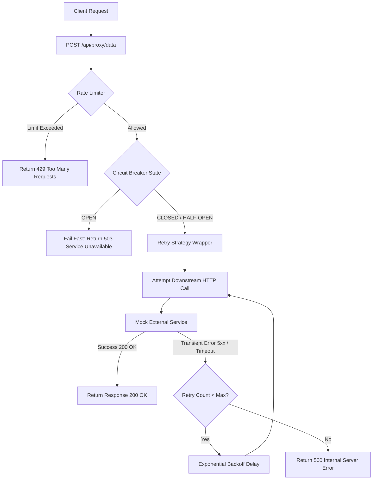

# Resilient External Service Proxy API

A highly resilient API proxy gateway that intercepts client traffic, applies a **Sliding Window Rate Limiter**, checks **Circuit Breaker** states, and runs an **Exponential Backoff Retry Strategy** before forwarding requests to an external (mock) service.

Built with Python and FastAPI, the gateway is containerized and managed using Docker Compose.

---

## Architecture and Design

The system implements the resilience pipeline in a layered, sequential order:



### Component Details

1. **Rate Limiter (Sliding Window Log)**: Uses an in-memory sliding window history per Client IP. Timestamps older than the window size are purged on every request.
2. **Circuit Breaker state machine**:
   - **CLOSED**: Requests flow normally. Failures increment a consecutive failure counter.
   - **OPEN**: Rejects incoming requests immediately (fail-fast) with HTTP `503 Service Unavailable` for `CB_RESET_TIMEOUT_SECONDS`.
   - **HALF-OPEN**: After the timeout expires, the next incoming request acts as a probe. If the probe succeeds, the state transitions back to `CLOSED`. If it fails, it immediately trips back to `OPEN`.
3. **Retry Strategy**: Automatically retries failed network calls or 5xx HTTP errors with an exponentially increasing delay, e.g., `100ms`, `200ms`, `400ms`. Permanent client errors (HTTP 4xx) bypass retries and fail immediately.

---

## Directory Structure

```
project-root/
├── src/
│   ├── config/            # Configuration loading and type parsing
│   │   └── settings.py
│   ├── core/              # Core resilience implementations
│   │   ├── rate_limiter/  # Sliding Window Log logic
│   │   │   └── sliding_window.py
│   │   ├── circuit_breaker/ # State machine logic (CLOSED/OPEN/HALF-OPEN)
│   │   │   └── state_machine.py
│   │   ├── retry/         # Backoff and retry logic
│   │   │   └── backoff.py
│   │   └── instances.py   # State singletons (limiter/circuit breaker)
│   ├── routes/            # API Route handlers
│   │   ├── health.py      # GET /health
│   │   └── proxy.py       # POST /api/proxy/data
│   └── main.py            # FastAPI Entrypoint
├── external_mock_service/ # Downstream flaky service simulating latency/failures
│   ├── main.py
│   └── Dockerfile
├── tests/                 # Unit and integration test suites
│   ├── test_rate_limiter.py
│   ├── test_circuit_breaker.py
│   ├── test_retry.py
│   └── test_integration.py
├── .env.example           # Environment variables documentation
├── docker-compose.yml     # Container orchestration
├── Dockerfile             # Proxy service container definition
└── README.md              # Setup and design document
```

---

## Configuration Variables

Configured in `.env.example` (or passed via Docker Compose):

| Variable Name | Type | Description |
|---|---|---|
| `EXTERNAL_SERVICE_URL` | String | Target URL to forward requests to. |
| `RATE_LIMIT_WINDOW_SECONDS` | Integer | Sliding window size in seconds. |
| `RATE_LIMIT_MAX_REQUESTS` | Integer | Max allowed requests per client within the window. |
| `CB_FAILURE_THRESHOLD` | Integer | Failures required to trip Circuit Breaker to OPEN. |
| `CB_RESET_TIMEOUT_SECONDS`| Integer | Cooldown duration before attempting recovery. |
| `RETRY_MAX_ATTEMPTS` | Integer | Maximum retry attempts per request. |
| `RETRY_INITIAL_DELAY_MS` | Integer | Base backoff delay in milliseconds. |
| `RETRY_BACKOFF_MULTIPLIER` | Float/Int| Multiplier factor for exponential delays. |

---

## Getting Started

### 1. Build and Run the Stack
Start both services in the background using Docker Compose:
```bash
docker-compose up -d --build
```

### 2. Verify Health
Verify both containers started and are healthy:
- Proxy Service:
  ```bash
  curl http://localhost:8000/health
  # Expected: {"status": "healthy"}
  ```
- Mock Service:
  ```bash
  curl http://localhost:5001/health
  # Expected: {"status": "healthy"}
  ```

---

## Testing

A complete test suite is provided in the `tests/` directory.

### 1. Running Unit Tests
You can run the unit tests locally (without Docker) to verify individual resilience pattern logic.

**Prerequisites**:
Install requirements:
```bash
pip install fastapi uvicorn httpx pytest pytest-asyncio
```

**Run tests**:
```bash
pytest
```
*Note: If the docker containers are not running, integration tests will be skipped automatically.*

### 2. Running Integration Tests
To execute full end-to-end integration tests (Rate Limiting concurrent bursts and Circuit Breaker fail-fast/recovery states):

1. Make sure your docker containers are running (`docker-compose up -d`).
2. Run pytest:
   ```bash
   pytest
   ```
   The suite will automatically detect port 8000 is open, run the integration tests against the live containers, and verify rate limiting, retry backoff, and circuit breaker trip/probe/recovery behavior.
